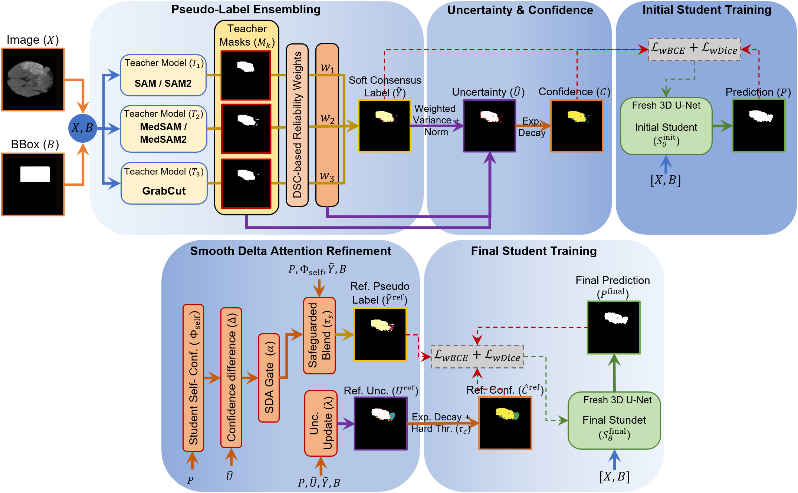

# TRUST-Seg: A Multi-Teacher Ensemble Framework for Weakly Supervised Brain Lesion Segmentation



> This is the official implementation of **TRUST-Seg: A Multi-Teacher Ensemble Framework for Weakly Supervised Brain Lesion Segmentation**.

**Release date:** 26/Aug/2026

## Abstract

TRUST-Seg (Teacher-Refined Uncertainty-aware Soft-label Training) is a weakly supervised framework for volumetric brain lesion segmentation. It combines heterogeneous pseudo-label generators, including vision foundation models and GrabCut, into a reliability-weighted soft consensus. Inter-teacher disagreement supplies voxel-wise uncertainty and confidence weights for an initial 3D U-Net. Smooth Delta Attention (SDA) then balances the initial student's self-confidence against teacher certainty to refine the supervisory targets. A second 3D U-Net is trained from scratch on the refined pseudo-labels. The method was evaluated on ISLES 2022 and BraTS 2019 using only bounding-box supervision for student training.

## Installation

The experiments were conducted with Python 3.10, PyTorch 2.6, and CUDA 12.5. Ensure that you install all the dependencies listed in `requirements.txt`.

```bash
conda create -n trustseg python=3.10 -y
conda activate trustseg
cd TRUST-Seg
pip install -r requirements.txt
```

SAM, SAM2, MedSAM, and MedSAM2 are external projects and are intentionally not installed by the command above. See [External pseudo-label generators](#external-pseudo-label-generators).

## Datasets
ISLES-2022 dataset can be downloaded from [Kaggle](https://www.kaggle.com/datasets/orvile/isles-2022-brain-stoke-dataset), and BraTS-2019 dataset from [Kaggle](https://www.kaggle.com/datasets/aryashah2k/brain-tumor-segmentation-brats-2019/data). Users are responsible for accepting and following each dataset's access and usage terms.

TRUST-Seg uses:

- ISLES 2022: DWI volumes and binary stroke-lesion labels; 187 training, 25 validation, and 38 test cases.
- BraTS 2019: FLAIR volumes with all tumor subregions merged into one binary label; 252 training, 33 validation, and 50 test cases.

The training commands use reconstructed NIfTI volumes with this structure:

```text
data/ISLES_128/
├── 3D_volumes/
│   ├── train_00_NIFTI/
│   │   ├── images/       # <case>_image.nii.gz
│   │   ├── bboxes/      # <case>_bbox.nii.gz
│   │   └── labels/      # <case>_label.nii.gz
│   ├── val_00_NIFTI/
│   └── test_00_NIFTI/
├── sam_masks/
├── sam2_masks_3D/
├── medsam2_masks_3D/
├── grabcut_masks/
└── ensemble_masks_3D/
```

Use `configs/isles22.yaml` and `configs/brats19.yaml` for full experiments. 

## Preprocessing

### 1. Generate 2D slices

If starting from paired 3D NIfTI volumes, create normalized `128 x 128` axial image slices and binary label slices:

```bash
python scripts/preprocess/slice_volumes.py \
  --images-dir /path/to/nifti/images \
  --labels-dir /path/to/nifti/labels \
  --output-images data/ISLES_128/ISLES22_DWI_128/DWI/train \
  --output-labels data/ISLES_128/ISLES22_DWI_128/Mask/train \
  --size 128
```

Repeat for validation and test cases. This step can be skipped when the prepared PNG slices already exist.

### 2. Generate tight slice-wise bounding boxes

```bash
python scripts/preprocess/generate_bboxes.py \
  --labels-dir data/ISLES_128/ISLES22_DWI_128/Mask/train \
  --output-json data/ISLES_128/bbox_train_000.json \
  --bbox-masks-dir data/ISLES_128/bbox_masks/train_000 \
  --expansion 0
```

Each connected lesion receives a tight 2D box. Intersecting boxes are recursively merged. 
> The paper's main experiments use `--expansion 0`; positive values reproduce the expanded-box ablations.

### 3. Reconstruct image, label, and bbox volumes

```bash
python scripts/preprocess/build_volumes.py \
  --images-dir data/ISLES_128/ISLES22_DWI_128/DWI/train \
  --labels-dir data/ISLES_128/ISLES22_DWI_128/Mask/train \
  --bbox-json data/ISLES_128/bbox_train_000.json \
  --output-dir data/ISLES_128/3D_volumes/train_00_NIFTI
```

> If a label PNG is absent, the script treats that slice as empty by default. Use `--strict-labels` to require a label file for every image slice.

## External pseudo-label generators

This repository does not redistribute foundation-model source code or checkpoints. Download and install each required method from its original source:

- [Segment Anything (SAM)](https://github.com/facebookresearch/segment-anything)
- [SAM 2](https://github.com/facebookresearch/sam2)
- [MedSAM](https://github.com/bowang-lab/MedSAM)
- [MedSAM2](https://github.com/bowang-lab/MedSAM2)

Users are responsible for downloading the repositories and checkpoints, satisfying their licenses, installing their dependencies, and generating their own pseudo-labels. The scripts below only adapt locally installed models to TRUST-Seg's images and bbox prompts.

> The paper uses SAM-L, MedSAM2-B, and GrabCut for ISLES 2022, and MedSAM2-CT, SAM2-S, and GrabCut for BraTS 2019.

### 1. For SAM or MedSAM 2D inference:

```bash
python scripts/external/generate_sam_2d.py \
  --external-repo /path/to/segment-anything-or-MedSAM \
  --checkpoint /path/to/checkpoint.pth \
  --model-type vit_l \
  --images-dir data/ISLES_128/ISLES22_DWI_128/DWI/train \
  --bbox-json data/ISLES_128/bbox_train_000.json \
  --output-dir data/ISLES_128/sam_masks/vit_l/train_000
```

Convert the resulting slices to volumes with `scripts/preprocess/stack_masks.py`.

### 2. For SAM2 or MedSAM2 volumetric inference:
Use the supplied adaptation of `generate_sudo_sam2_sam3d_2dbbox`:

```bash
python scripts/external/generate_sam2_3d.py \
  --external-repo /path/to/SAM2-or-MedSAM2 \
  --checkpoint /path/to/checkpoint.pt \
  --model-config MODEL_CONFIG_FROM_THE_EXTERNAL_REPOSITORY \
  --images-dir data/ISLES_128/3D_volumes/train_00_NIFTI/images \
  --bboxes-dir data/ISLES_128/3D_volumes/train_00_NIFTI/bboxes \
  --output-dir data/ISLES_128/medsam2_masks_3D/pix0/train_00_2411
```

The selected external checkout must provide `build_sam2_video_predictor_npz`, as used by the original experiment script. Model configuration names and checkpoint locations come from the external repository and may differ across releases.

### 3. For Generate GrabCut inference:

```bash
python scripts/external/generate_grabcut.py \
  --images-dir data/ISLES_128/ISLES22_DWI_128/DWI/train \
  --bbox-json data/ISLES_128/bbox_train_000.json \
  --output-dir data/ISLES_128/grabcut_masks/train_000

python scripts/preprocess/stack_masks.py \
  --masks-dir data/ISLES_128/grabcut_masks/train_000 \
  --reference-images data/ISLES_128/3D_volumes/train_00_NIFTI/images \
  --output-dir data/ISLES_128/grabcut_masks/volumes_train_000
```

## Training and evaluation

Set dataset paths, teacher directories, reliability scores, device, and hyperparameters in the appropriate YAML file.

### 1. Build the teacher consensus

```bash
python prepare_ensemble.py --config configs/isles22.yaml
```

This produces the reliability-weighted soft target, normalized disagreement uncertainty, and exponential confidence map for every training case.

### 2. Train the initial student

```bash
python train.py --config configs/isles22.yaml --stage initial
```

### 3. Apply Smooth Delta Attention refinement

```bash
python refine.py \
  --config configs/isles22.yaml \
  --checkpoint runs/isles22/initial/best_model.pth
```

### 4. Train the final student from scratch

```bash
python train.py --config configs/isles22.yaml --stage final
```

### 5. Evaluate the final model

```bash
python evaluate.py \
  --config configs/isles22.yaml \
  --checkpoint runs/isles22/final/best_model.pth \
  --output outputs/isles22_test
```

Evaluation reports patient-level 3D DSC, IoU, HD95, and ASD and saves the predicted NIfTI masks. Ground-truth masks are used to simulate bbox priors, calibrate dataset-level teacher reliability on the validation split, select checkpoints, and report metrics. They are not used as TRUST-Seg student optimization targets.

## Repository structure

```text
TRUST-Seg/
├── configs/                 # Dataset paths and paper hyperparameters
├── data/                    # Dataset and its instructions
├── scripts/
│   ├── external/            # Local SAM-family and GrabCut adapters
│   └── preprocess/          # Slicing, bboxes, and volume building
├── tests/                   # Core mathematical and model tests
├── trustseg/                # Dataset, model, loss, ensemble, SDA, and metrics
├── prepare_ensemble.py
├── train.py
├── refine.py
├── evaluate.py
└── ...
```

## Acknowledgements

TRUST-Seg uses the 3D U-Net architecture and builds on pseudo-labels generated with SAM, SAM2, MedSAM, MedSAM2, and GrabCut. We thank the authors of these projects and the organizers of ISLES 2022 and BraTS 2019 for making their work and datasets available to the research community.

